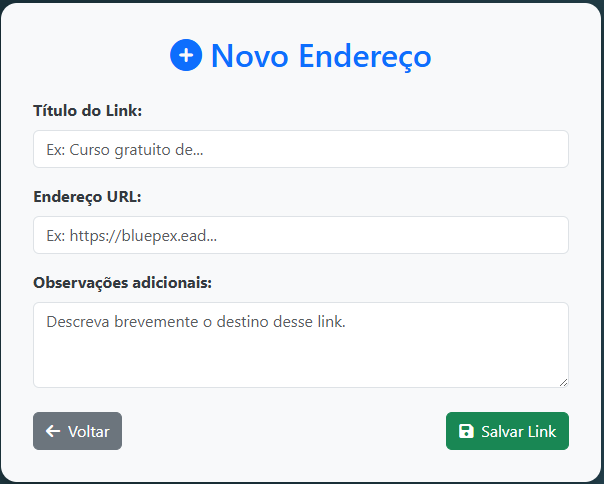
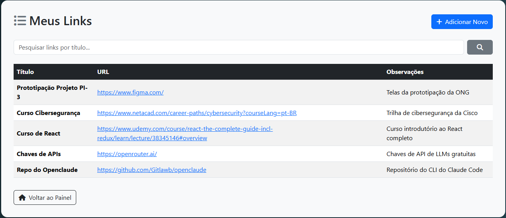
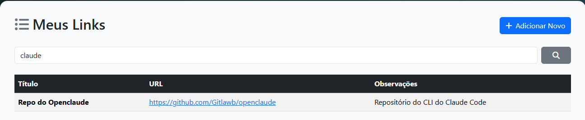
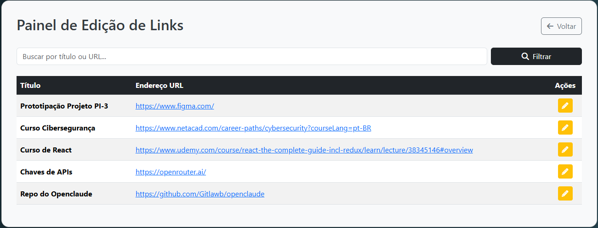
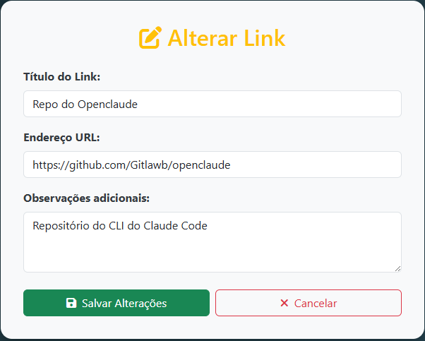
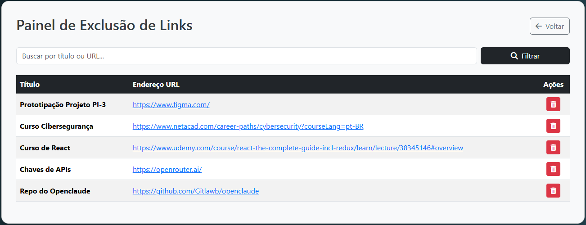
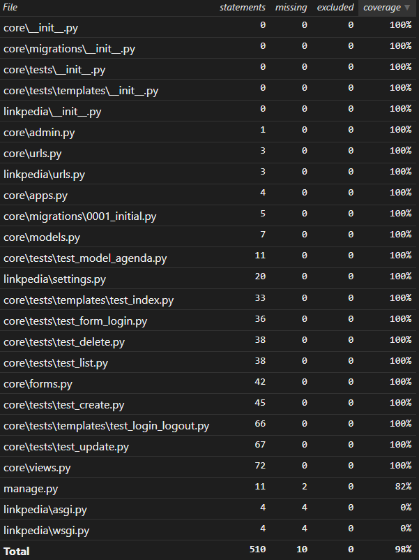

# Prática TDD 5

Desafio técnico para os alunos da disciplina "Desenvolvimento Web 3"

---

## Como executar o projeto

**Linux:**

```console
git clone https://github.com/orlandosaraivajr/Pratica_TDD_5.git
cd Pratica_TDD_5/
virtualenv -p python3 venv
source venv/bin/activate
pip install -r requirements.txt
cd linkpedia/
python manage.py migrate
python manage.py test
coverage run --source='.' manage.py test
coverage html
python manage.py createsuperuser
python manage.py runserver
```

**Windows:**

```console
git clone https://github.com/orlandosaraivajr/Pratica_TDD_5.git
cd Pratica_TDD_5/
virtualenv venv
cd venv\scripts
activate.bat
cd ..\..
pip install -r requirements.txt
cd linkpedia/
python manage.py migrate
python manage.py test
coverage run --source='.' manage.py test
coverage html
python manage.py createsuperuser
python manage.py runserver
```

Crie um superusuário com as seguintes credenciais:

- Username: **aluno**
- E-mail: **seu e-mail institucional (@cps.sp.gov.br)**
- Password: **fatec**

---

## Sprint 1 — Login e Logout


A expectativa do projeto é ter um cadastro de links. O que foi priorizado na primeira sprint foi o sistema de login/logout. O login somente pode ocorrer com e-mail institucional @cps.sp.gov.br.


Imagem 1: Tela de Login


Imagem 2: Tela Index


Imagem 3: Tela de Logout

---

## Sprint 2 — CRUD de Links

Com base no modelo implementado, foram desenvolvidas as operações de CRUD completo com proteção por autenticação.


✅ Formulário para o modelo `LinkModel` com validação de URL e duplicidade

✅ Cadastrar link — somente usuários autenticados

✅ Listar links — com busca por título, URL e observação

✅ Atualizar link — com formulário pré-preenchido

✅ Remover link — com confirmação via dialog

✅ Todas as rotas protegidas com `@login_required`



Imagem 4: Tela de Cadastro



Imagem 5: Tela de Listagem



Imagem 6: Tela de Filtragem de Links



Imagem 7: Tela de Gerenciamento de Edição



Imagem 8: Tela de Edição



Imagem 9: Tela de Gerenciamento de Exclusão

---

## Testes e Cobertura

Os testes foram escritos seguindo a metodologia TDD, organizados por operação do CRUD:

| Arquivo | Responsabilidade |
|---|---|
| `test_index.py` | Acesso à home e proteção por login |
| `test_login_logout.py` | Autenticação e validação de e-mail institucional |
| `test_form_login.py` | Validações do formulário de login |
| `test_model_agenda.py` | Validações do modelo `LinkModel` |
| `test_create.py` | Cadastro de links |
| `test_list.py` | Listagem e busca de links |
| `test_update.py` | Edição de links |
| `test_delete.py` | Exclusão de links |

A cobertura de testes foi mantida acima de 90% ao longo de toda a Sprint 2.



Imagem 10: Cobertura de testes — Sprint 2
